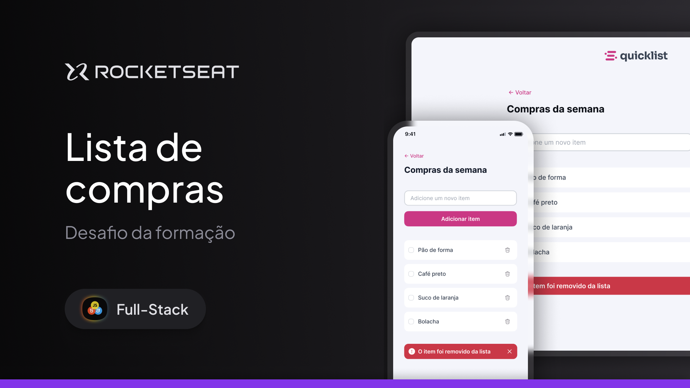

  

---

  

## 🖥️ Sobre o Projeto

Neste repositório está hospedado uma aplicação web responsiva utilizando a sintaxe da linguagem javascript para desenvolver um algoritmo que lista itens de compra em formato de checklist. Este projeto foi desenvolvido durante desafio prático criado pelo [Rocketseat](https://www.rocketseat.com.br) em sua trilha de Fullstack, projeto importante para consolidação dos fundamentos da linguagem referente.

## 🚧 Status

Atualmente o projeto está afirmado como completo, visto estar atendendo as requisições exigidas do desafio, mas pode-se deixar margens para futuras atualizações como inserção de banco de dados para armazenar os itens inseridos permanentemente.

## 🍪 Acesso ao Projeto

O layout do projeto pode ser visualizado através da prototipação no [Figma](https://www.figma.com), neste [link](https://www.figma.com/design/Lcg2Ujk7KmsgTyyyyb4nAz/Quicklist---Lista-de-Compras?node-id=0-1&p=f&t=iVOM0gaWAPaefY3t-0). Ou então através de seu dominio web no github pages [aqui](https://ppedrolucas.github.io/quicklist/).

## 🚀 Tecnologias

As seguintes tecnologias e ferramentas foram usadas para a implementação:

  

## Autor

<a href="https://github.com/ppedrolucas">
  
   
 <b>Pedro Lucas 🚀</b>
 </a>

Feito com ❤️ por Pedro Lucas 👋🏽 Entre em contato!

  
